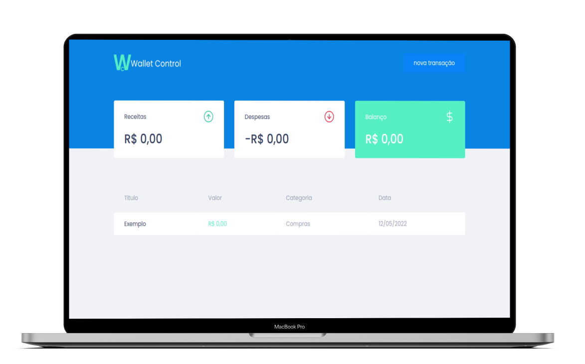

<h1 align="center">
     
</h1>

**Wallet-control** is a personal finance manager. Using it you will be able to efficiently manage your assets and to handle every single inflow or outflow of value, giving you more control of your money.

<p align="center" >
    
</p>

## 🚀 Technologies

- TypeScript
- React
- React-modal
- React ContextApi
- Styled-components
- Axios
- Miragejs
- Polished

## ℹ️ How to Execute

- ### **Preconditions**
  - You must have Node.js installed on your computer.
  - You must have Git installed and configured on your computer.
  - Also, you need to have a package manager, either NPM or Yarn.

1. Make a clone of the repository:

```sh
  $ git clone https://github.com/Djaysson/Wallet-Control.git
```

2. Application Execution:

```sh
  # Go to the project folder.
  $ cd Wallet-Control

  # Installing the project dependencies.
  $ yarn install # or npm install

  # Run the app
  $ yarn start # or npm start
```

Made by Djayson Rodrigues 👋 [Linkedin](https://www.linkedin.com/in/djaysonrodrigues/)
